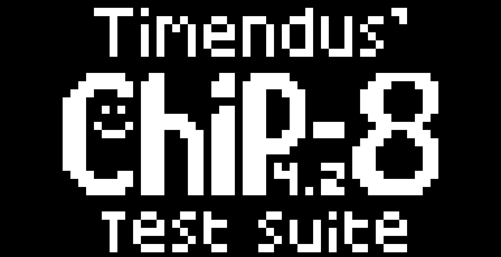

# Chip8
Chip8 emulator i made with C++ and SDL3

The main goal of this mini project was to learn C++, it was a fun experience learning SDL3 and implementing a logical cpu architecture.

# References
[guide](https://austinmorlan.com/posts/chip8_emulator/)  
[other guide](https://tobiasvl.github.io/blog/write-a-chip-8-emulator/) (no code)

# How to run
```./main <videoScale> <cycleDelay> <ROMPath>```
# Controls
```
Keypad       Keyboard
+-+-+-+-+    +-+-+-+-+
|1|2|3|C|    |1|2|3|4|
+-+-+-+-+    +-+-+-+-+
|4|5|6|D|    |Q|W|E|R|
+-+-+-+-+ => +-+-+-+-+
|7|8|9|E|    |A|S|D|F|
+-+-+-+-+    +-+-+-+-+
|A|0|B|F|    |Z|X|C|V|
+-+-+-+-+    +-+-+-+-+
```
# Screenshots

